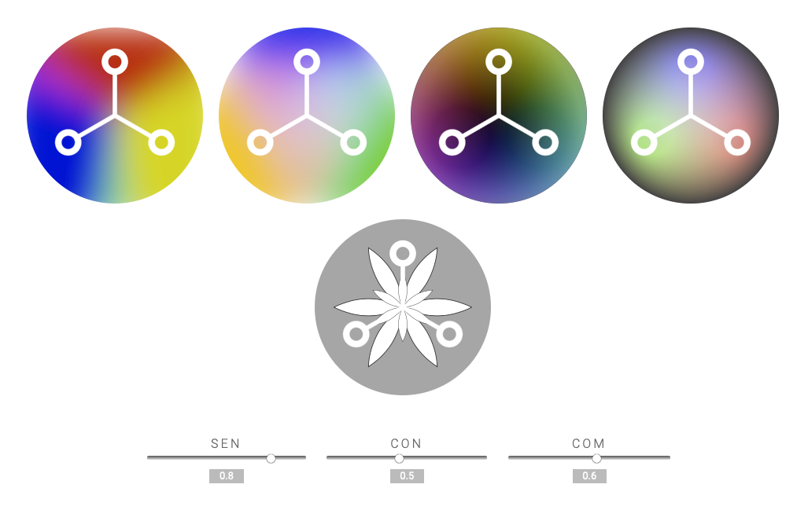

# HappUI

[](https://gfio-happui.glitch.me/)

WebComponent ‹Sentir—Comprendre—Connaître›, following Enrique Pardo's
requirements and concept (described at https://happui.org/app/).

## Current status

```html
<happ-ui-exp01 title="Color Wheel 1"
  sentir="0.8" connaitre="0.8" comprendre="0.8"></happ-ui-exp01>
<happ-ui-exp01 title="Color Wheel 2"
  sentir="0.8" connaitre="0.5" comprendre="0.6"></happ-ui-exp01>
```



## Our \<happ-ui> Web Component

This webcomponent follows the [open-wc](https://github.com/open-wc/open-wc) recommendation.

## Installation

```bash
npm install happ-ui
```

## Usage

```html
<script type="module">
    import { HappUiExp01 } from './src/HappUiExp01.js';
    window.customElements.define('happ-ui-exp01', HappUiExp01);

    import { HappUiExp02 } from './src/HappUiExp02.js';
    window.customElements.define('happ-ui-exp02', HappUiExp02);
</script>

<happ-ui-exp01 title="Color Wheel Exp 01"
  sentir="0.65" connaitre="0.65" comprendre="0.65"></happ-ui-exp01>
<happ-ui-exp02 title="Color Wheel Exp 02"
  sentir="0.65" connaitre="0.65" comprendre="0.65"></happ-ui-exp02>
```

## Demoing with Storybook

To run a local instance of Storybook for your component, run

```bash
npm run storybook
```

To build a production version of Storybook, run

```bash
npm run storybook:build
```

## Tooling configs

For most of the tools, the configuration is in the `package.json` to reduce the amount of files in your project.

If you customize the configuration a lot, you can consider moving them to individual files.

## Local Demo with `es-dev-server`

```bash
npm run watch
```

To run a local development server that serves the basic demo located in `index.html`.
