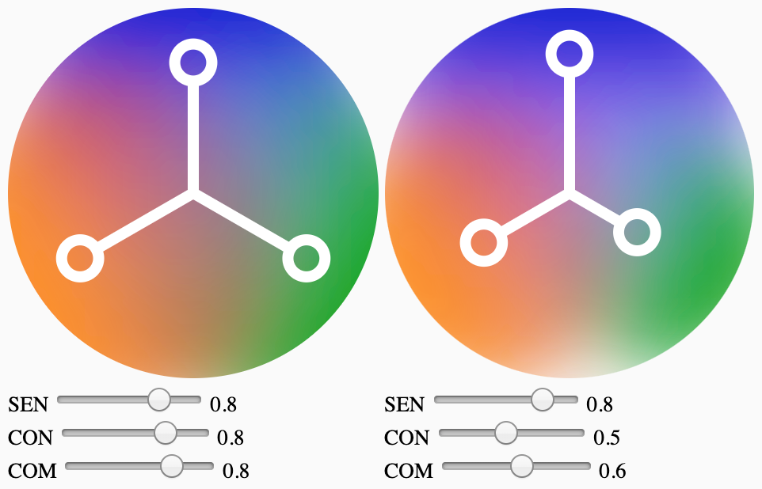

# HappUI

WebComponent ‹Sentir—Comprendre—Connaître›, following Enrique Pardo's requirements and concept, described at https://happui.org/app/

## Current status

```html
<happ-ui title="First"></happ-ui>
<happ-ui title="Second"></happ-ui>
```


